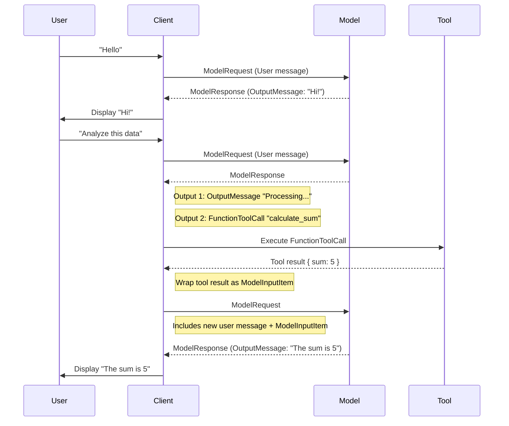

# Responses API – Example Timeline Sequence

 

### ✅ **Notes / Developer Takeaways**

1. **Client manages the timeline** – append-only message and tool output order.
2. **Multi-output responses** – `ModelResponse.output` can contain multiple outputs per turn.
3. **Tool integration** – tool calls are executed client-side and fed back as `ModelInputItem`.
4. **Roles and content** – messages maintain roles (`user`, `assistant`, `tool`, etc.) and can be multimodal.
5. **Determinism** – feed timeline replay for full context; `previous_response_id` is best-effort.

