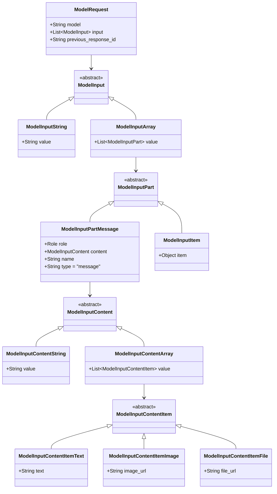
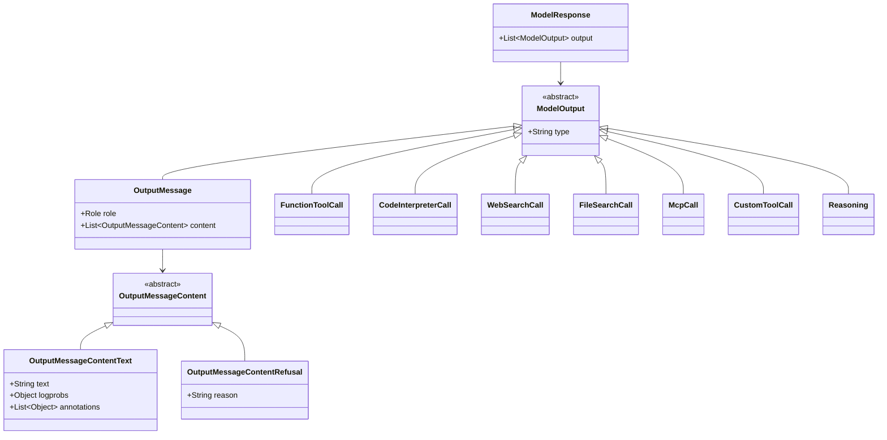

# Responses API – Object Model Diagrams

A combined Mermaid class diagram showing the full schema hierarchy for the Responses API: 
`ModelRequest` → `ModelInputPart` → `ModelInputContentItem` and `ModelResponse` → `ModelOutput`. 

### ModelRequest Hierarchy

#### ModelResponse Hierarchy

### ✅ **Diagram Highlights**

1. **Request side (`ModelRequest`)**

   * `ModelRequest` → `ModelInput` (string or array) → `ModelInputPart` (message or tool output) → `ModelInputContent` → `ModelInputContentItem` (text/image/file)
   * Fully typed, append-only, and ordered.

2. **Response side (`ModelResponse`)**

   * `ModelResponse` → `ModelOutput` → multiple types: messages, reasoning, and tool calls.
   * Messages contain `OutputMessageContent` (text/refusal) or more complex multimodal content.

3. **Polymorphism everywhere**

   * `abstract` base classes allow deserialization based on `type` fields.

4. **Tool integration and reasoning**

   * `FunctionToolCall`, `CodeInterpreterCall`, `WebSearchCall`, etc. are first-class output types.

