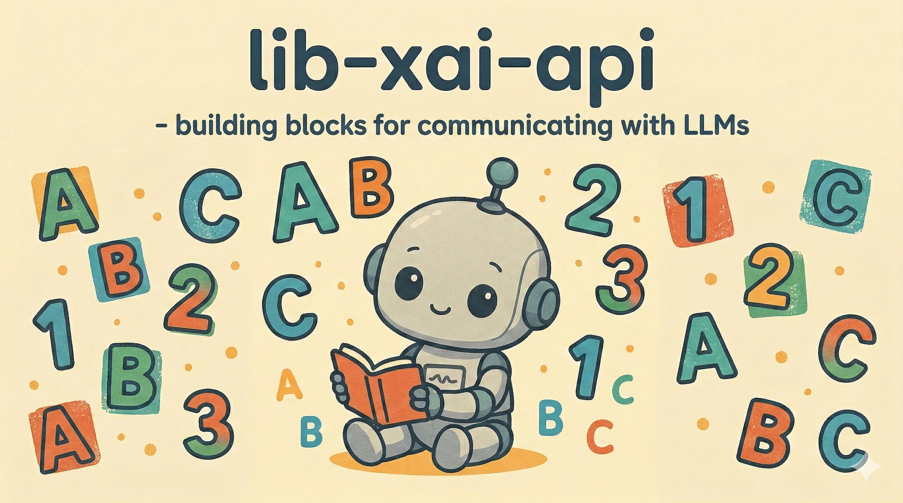
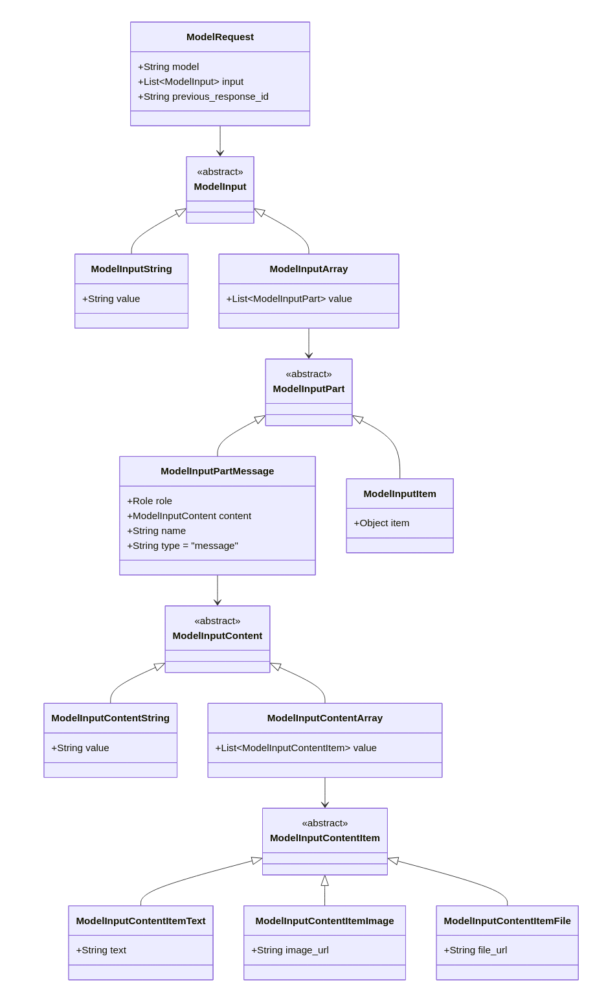
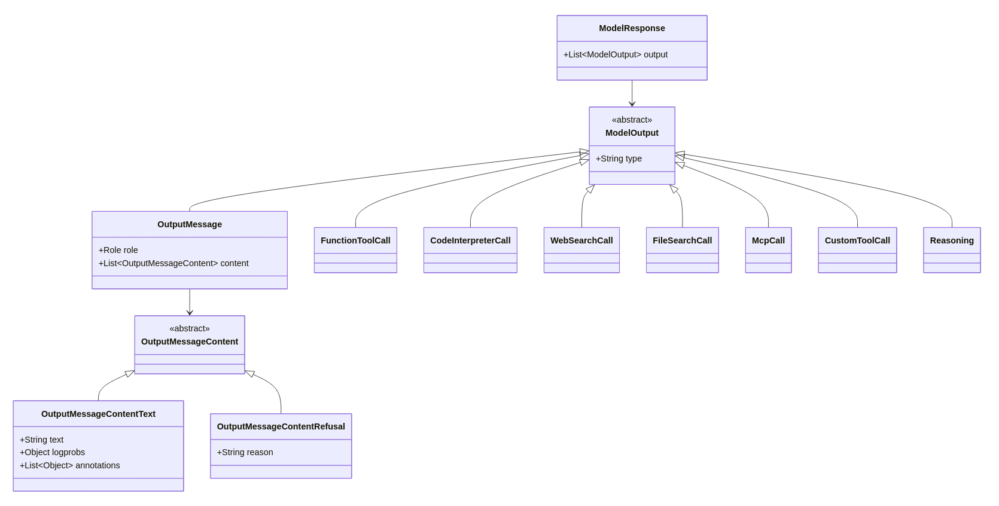
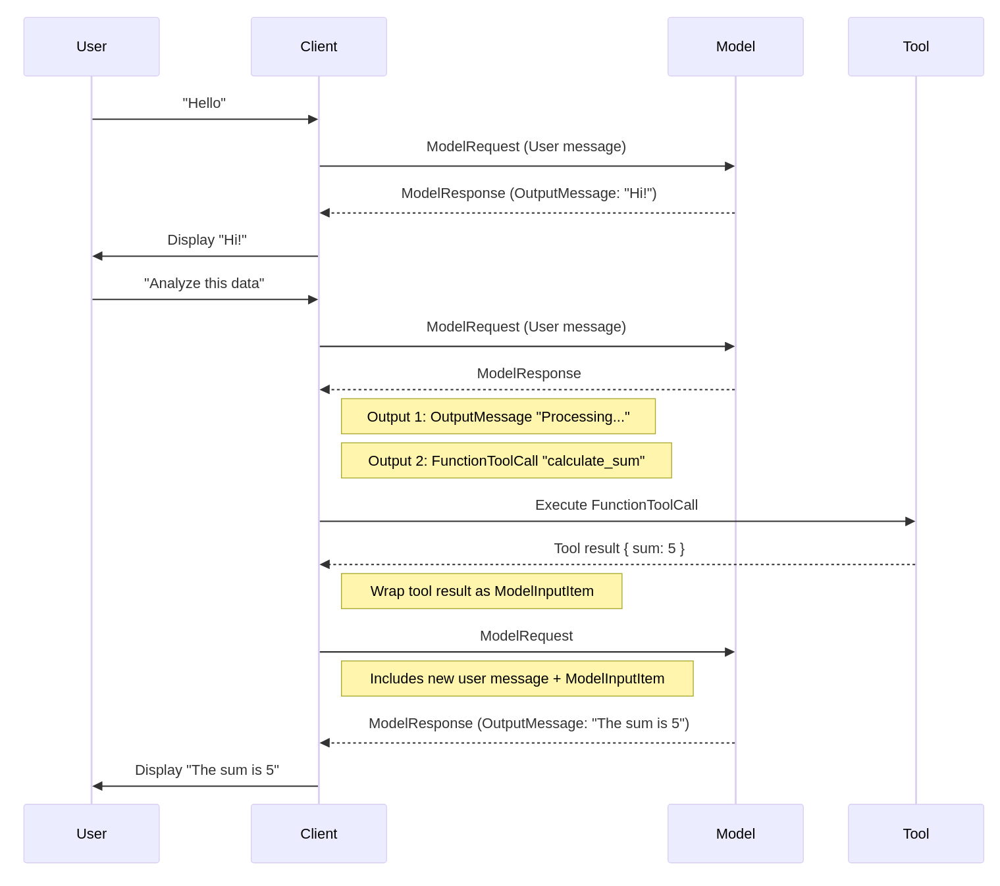

# lib-xai-api



**Java client library for the xAI Grok API**  
Modern endpoints – focused on `/v1/responses`

`lib-xai-api` is a lightweight Java library that provides:

- Strongly typed **DTOs** matching the current xAI REST API (especially the `/v1/responses` family)
- Basic synchronous HTTP clients using `java.net.http` (Java 11+)
- Support for tool calls, structured outputs, reasoning traces, usage details, multimodal inputs
- **No legacy endpoints** (`/v1/chat/completions`, `/v1/completions`, Anthropic-style `/complete`, etc.)

The library follows the current xAI OpenAPI specification and aims to give Java developers a 
clean, dependency-minimal way to call Grok models (Grok 4 family and successors).

## Object Model

99% of the time you'll interact with the **responses** api using the _ModelRequest_ and _ModelResponse_ objects.


| ModelRequest | ModelResponse |
|---|---|
|  |  | 


## Responses REST End Point Sequence

The responses end point enables iterative LLM chat sessions with the LLM.





Chat sessions continuity is established through the use of a _previousResponseId_ value. 
The _previousResponseId_ functions like a cookie that you can use to mimic a stateful 
session with the LLM. (Yes - they reinvented the wheel ... again.)


## Features

- Complete POJO/DTO coverage for:
  - `ModelRequest` / `ModelResponse`
  - Multimodal & text input messages
  - Function/tool calling (built-in + custom)
  - Structured JSON Schema outputs
  - Reasoning traces & detailed token usage (including reasoning_tokens)
  - Image/video generation request/response DTOs (partial client support)
- Jackson 2.x serialization/deserialization with custom deserializers
- Builder helpers (`ModelRequestBuilder`, `ModelResponseReader`, etc.)
- Retry-capable HTTP client base class
- Test utilities (`EntityBuilder`, JSON round-trip tests)

## Requirements

- **Java 11** or later
- **Maven** (only)
- Runtime dependencies:
  - `com.fasterxml.jackson.core:jackson-databind` 2.12+
  - `com.fasterxml.jackson.core:jackson-annotations`
  - `com.fasterxml.jackson.core:jackson-core`
  - (optional) SLF4J API for logging

## Installation (Maven)

```xml
<dependency>
    <groupId>com.xai</groupId>
    <artifactId>lib-xai-api</artifactId>
    <version>1.0.0</version>  <!-- replace with latest version -->
</dependency>
```

> Note: This library is not yet published to Maven Central.  
> Use a local install, Git dependency, or private repository until official publication.

## Quick Example

```java
import com.xai.client.XAIClientConfig;
import com.xai.client.impl.ResponsesClientImpl;
import com.xai.api.responses.ModelRequest;
import com.xai.api.responses.ModelResponse;
import com.xai.api.util.ModelRequestBuilder;

public class SimpleGrokCall {

    public static void main(String[] args) throws Exception {
        // Reads XAI_API_KEY from environment or .env / properties
        var config = XAIClientConfig.fromEnv();
        var client  = new ResponsesClientImpl(config);

        ModelRequest request = ModelRequestBuilder.create()
                .withModel("grok-4-0709")
                .addUserMessage("Explain in one sentence why honey never spoils.")
                .build();

        ModelResponse response = client.generate(request);

        // Simple text access
        String answer = response.getText();
        System.out.println("Grok: " + answer);

        // Detailed usage info
        var usage = response.getUsage();
        System.out.printf("Tokens → prompt: %d | completion: %d | reasoning: %d | total: %d%n",
                usage.getPromptTokens(),
                usage.getCompletionTokens(),
                usage.getCompletionTokensDetails().getReasoningTokens(),
                usage.getTotalTokens());
    }
}
```

See [Authentication](readme-authentication.md) for more details about storing your grok API key.

## Project Structure (Key Parts)

```
src/main/java/com/xai/
├── api/
│   ├── responses/             # Core /v1/responses models + deserializers
│   ├── util/                  # ModelRequestBuilder, ModelResponseReader, etc.
│   ├── images/                # Image generation & edit DTOs
│   └── video/                 # Video generation DTOs
└── client/
    ├── XAIClientConfig.java
    └── impl/
        ├── AbstractClientImpl.java     # base HTTP logic + retry
        └── ResponsesClientImpl.java    # /v1/responses operations
```

## Current Scope & Limitations

- Primary focus: `/v1/responses` (POST, GET, DELETE)
- Partial client support for image/video endpoints (DTOs are present)
- No built-in streaming support yet
- No batch API client yet
- Legacy endpoints intentionally **excluded**

## Related Documentation

- xAI API Reference: https://docs.x.ai
- Generate Text (Responses API): https://docs.x.ai/developers/model-capabilities/text/generate-text
- Tool Use: https://docs.x.ai/developers/tools/overview
- Structured Outputs: https://docs.x.ai/developers/model-capabilities/text/structured-outputs

## License

Apache License 2.0


## Contributing

Thank you for your interest in contributing to **Groque**!

**How to Contribute**

1. Fork the repository on GitHub
2. Create a feature branch for your changes
3. Make your changes following the existing code style
4. Ensure the project builds cleanly in your OSGi environment
5. Open a Pull Request with a clear description of the changes

By submitting a contribution, you agree to license your changes under the project's [Apache License 2.0](LICENSE) and to the terms of our [Contributor License Agreement (CLA)](https://cla-assistant.io/groque-ai/groque).
We use [CLA Assistant](https://cla-assistant.io/) to manage this automatically on every pull request.

Please also note our [Code of Conduct](CODE_OF_CONDUCT.md).

