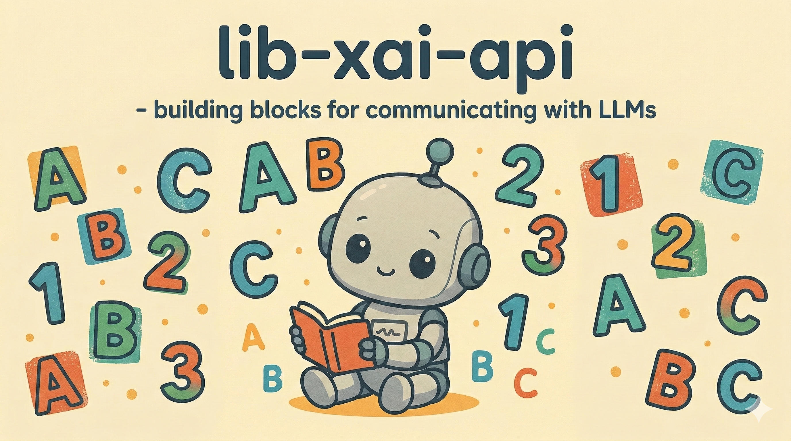
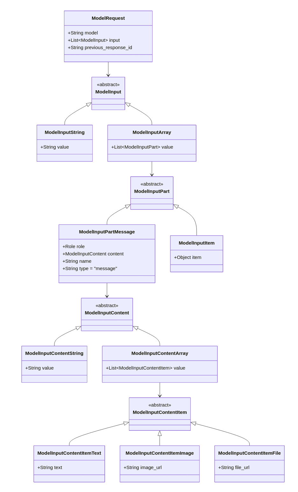
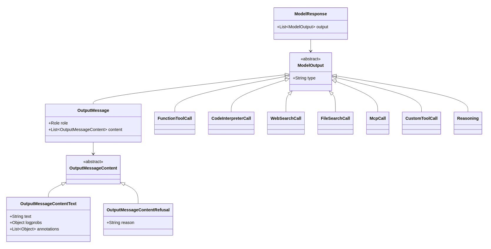
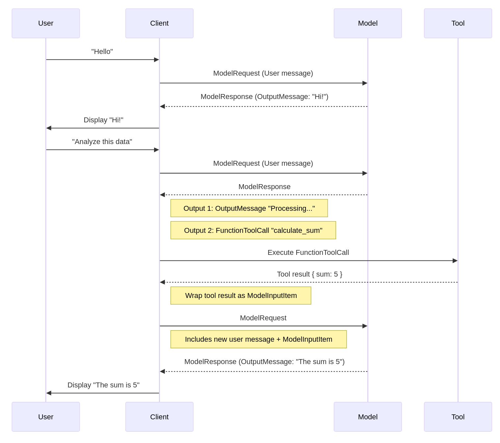

# lib-xai-api



**Java client library for the xAI Grok API**  
Modern endpoints – focused on `/v1/responses`

`lib-xai-api` is a lightweight Java library that provides:

- Strongly typed **DTOs** matching the current xAI REST API (especially the `/v1/responses` family)
- Basic synchronous HTTP clients using `java.net.http` (Java 11+)
- Support for tool calls, structured outputs, reasoning traces, usage details, multimodal inputs
- Optional **SSE streaming** (`generateStreaming`) as typed `StreamEvent`s
- **No legacy endpoints** (`/v1/chat/completions`, `/v1/completions`, Anthropic-style `/complete`, etc.)

The library follows the current xAI OpenAPI specification and aims to give Java developers a
clean, dependency-minimal way to call Grok models (Grok 4 family and successors).

## Object Model

99% of the time you'll interact with the **responses** api using the _ModelRequest_ and _ModelResponse_ objects.


| ModelRequest | ModelResponse |
|---|---|
|  |  |


## Responses REST End Point Sequence

The responses end point enables iterative LLM chat sessions with the LLM.





Chat sessions continuity is established through the use of a _previousResponseId_ value.
The _previousResponseId_ functions like a cookie that you can use to mimic a stateful
session with the LLM. (Yes - they reinvented the wheel ... again.)

## Installation (Maven)

```xml
<dependency>
    <groupId>ai.groque.lib</groupId>
    <artifactId>xai-api</artifactId>
    <version>1.1.0</version>
</dependency>
```

> Note: This library is not yet published to Maven Central.
> Use a local install, Git dependency, or private repository until official publication.

## Quick Example

```java
import com.xai.api.responses.ModelRequest;
import com.xai.api.responses.ModelResponse;
import com.xai.api.responses.usage.ModelUsage;
import com.xai.api.util.ModelRequestBuilder;
import com.xai.api.util.ModelResponseReader;
import com.xai.client.XaiResponsesClient;

public class SimpleGrokCall {

  public static void main(String[] args) {
    // API_KEY from the environment or ~/.xai
    XaiResponsesClient client = new XaiResponsesClient();

    ModelRequest request = new ModelRequestBuilder()
        .withModel("grok-4.6")
        .addUserMessage("Explain in one sentence why honey never spoils.")
        .build();

    ModelResponse response = client.generate(request);
    System.out.println("Grok: " + ModelResponseReader.getText(response));

    ModelUsage usage = response.getUsage();
    if (usage != null) {
      System.out.printf(
          "Tokens → input: %d | output: %d | reasoning: %d | total: %d%n",
          usage.getInputTokens(),
          usage.getOutputTokens(),
          usage.getOutputTokensDetails().getReasoningTokens(),
          usage.getTotalTokens());
    }
  }
}
```

See [Authentication](readme-authentication.md) for more details about storing your grok API key.

## Documentation

New to Responses? Start with the **tutorials**, then the **guides**.

### Tutorials (from zero)

1. [First response](docs/tutorials/01-first-response.md) — `generate`, print text
2. [Read the output list](docs/tutorials/02-read-the-output.md) — reasoning, not just the sentence
3. [Continue a conversation](docs/tutorials/03-continue-a-conversation.md) — `previous_response_id`
4. [Call a function](docs/tutorials/04-call-a-function.md) — you run it, you send the result back
5. [Stream tokens](docs/tutorials/05-stream-tokens.md) — `generateStreaming` and `StreamEvent`

Index: [docs/tutorials/README.md](docs/tutorials/README.md)

### Developer guides

1. [What is the Responses API?](docs/guides/01-what-is-responses.md)
2. [The object model](docs/guides/02-the-object-model.md)
3. [Conversation, roles, and tools](docs/guides/03-conversation-and-tools.md)
4. [Streaming on the wire](docs/guides/04-streaming-on-the-wire.md)
5. [This library](docs/guides/05-this-library.md) — opinionated Java model

Client how-tos: [blocking](docs/guides/responses-api.md) · [streaming](docs/guides/responses-streaming.md) · [llama.cpp](docs/guides/llama-cpp.md)

Index: [docs/guides/README.md](docs/guides/README.md)
